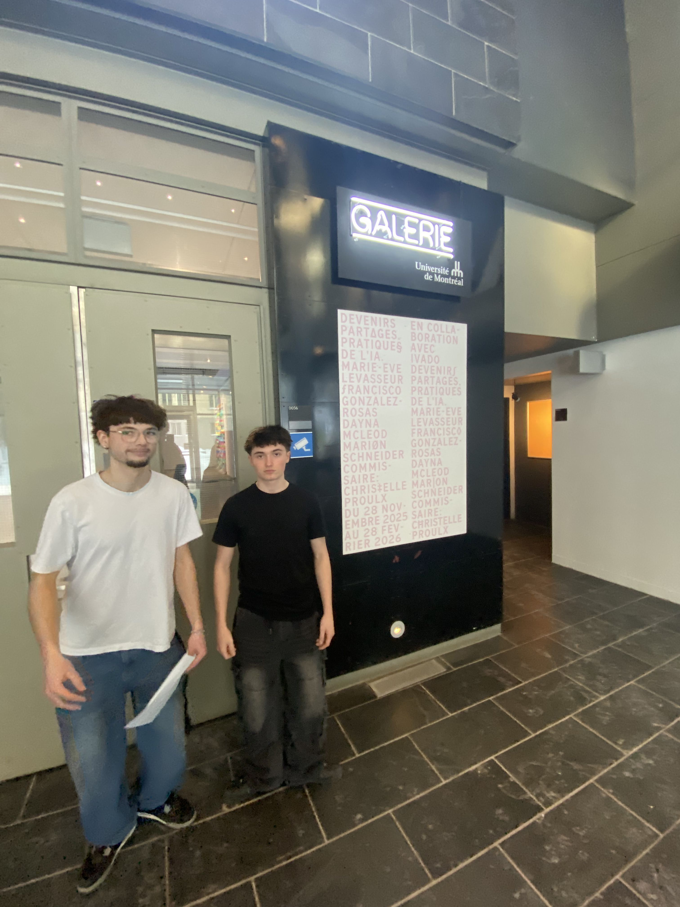
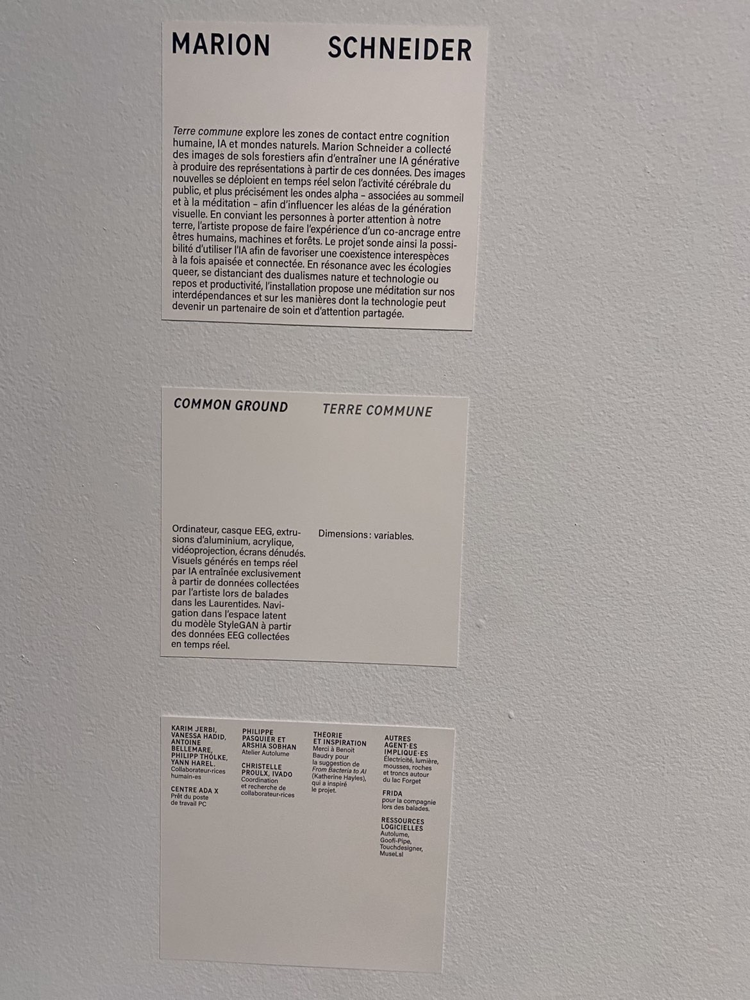
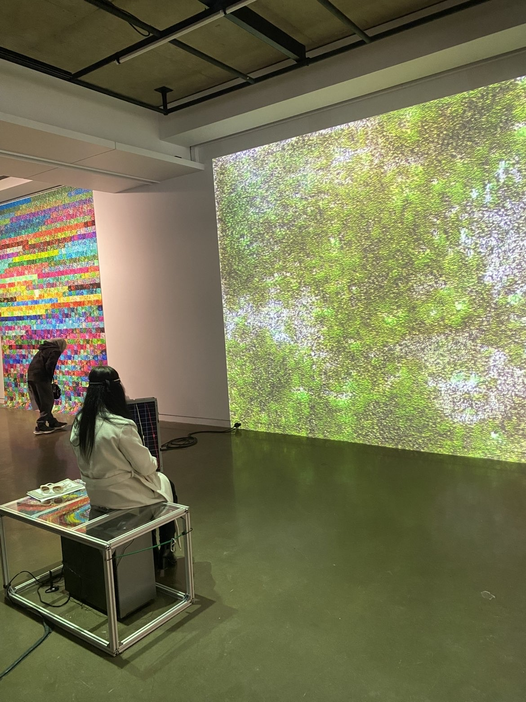
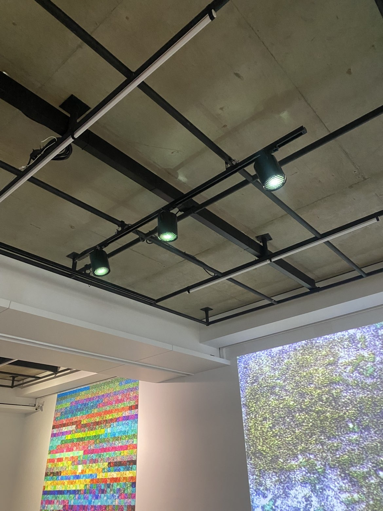

# Devenirs partagés. Pratique de l’IA

### Lieux de mise en exposition
- L'exposition se déroule au Galerie de l’Université de Montréal

*Moi et Jo devant l'entrée de l'exposition - photo Prise par Noah-C-Y*

### Type d’exposition
- Temporaire et intérieur. Du 28  novembre 2025 au 28 février 2026

### Date de visite
-  Le 30 janvier 2026

### Titre de l’œuvre  ou du dispositif 
- Terre Commune de Marion Schneider

### Nom de l’artiste ou de la firme
- Marion Schneider

### Année de la réalisation 
-  2025

### Description de l'œuvre ou du dispositif

*Cartel de l'oeuvre de Marion Schneider - photo prise par moi même*

### Type d’installation 
-  Immersive et interactive
 
 
 *Vu d'emsemble de l'oeuvre de Marion Schneider*
### Mise en espace 

*Croquis de terre commune, montrant le plan, les lumières, le projecteur et tout les autres éléments de l'oeuvre. - réaliser par moi même*

### Composante et technique :
- Un panneau qui est relié au pc et a un bandeau, qui prend en compte les ondes alpha et les affiches sur le panneau. Les images projeté sur le mur change en fonction des ondes qui sont projeté au tableau, donc dépendant de la personne qui porte le bandeau

*Rosalia qui essaye l'oeuvre de Marion Schneider avec le bandeau sur la tête - photo prise par moi même*
### Éléments nécessaires à la mise en exposition 
-  Murs, structure en métal en soutient pour les éclairages,un banc, écrans pour les ondes alpha, un ordinateur, un capteur d'onde alpha et un projecteur
  

* La structure de métale et les lumières - photo prise par moi*

*Projecteur, qui projette la réaction des ondes alpha en image sur le mur - photo prise par moi*

*L'écran servant a montrer les ondes alpha de la personne portant le bandeau - photo prise par moi*
 

### Mon expérience
- Mon expérience est asser mitiger, je m'attendais a quelque chose de beaucoup plus gros, et probablement plus pousser en terme d'intelligence artificiel, je pensais que j'allais voir des outils / des nouveaux moyen d'utiliser l'ia que je n'avais jamais vu auparavant, en vrai, ou en ligne sur les réseaux sociaux.
- Sinon ce qui ma le plus plu, c'est l'exposition que j'ai choisis, car je n'avais jamais vraiment entendue parler des ondes alpha et de les utiliser pour changer des images.
