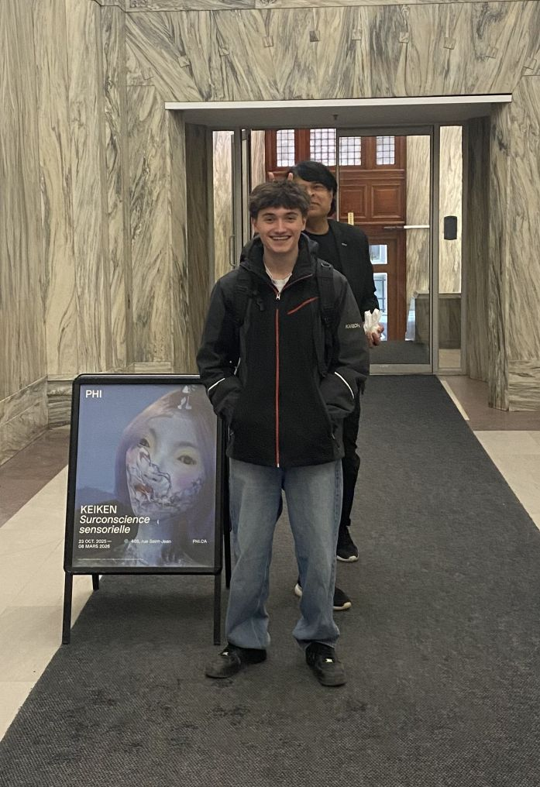
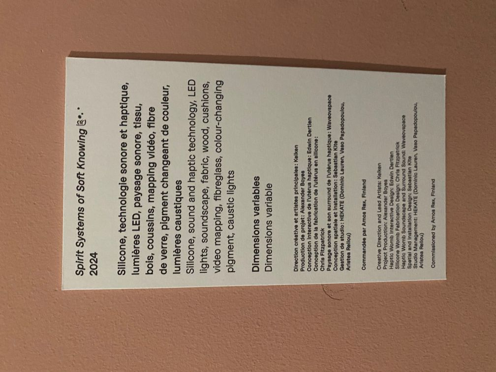
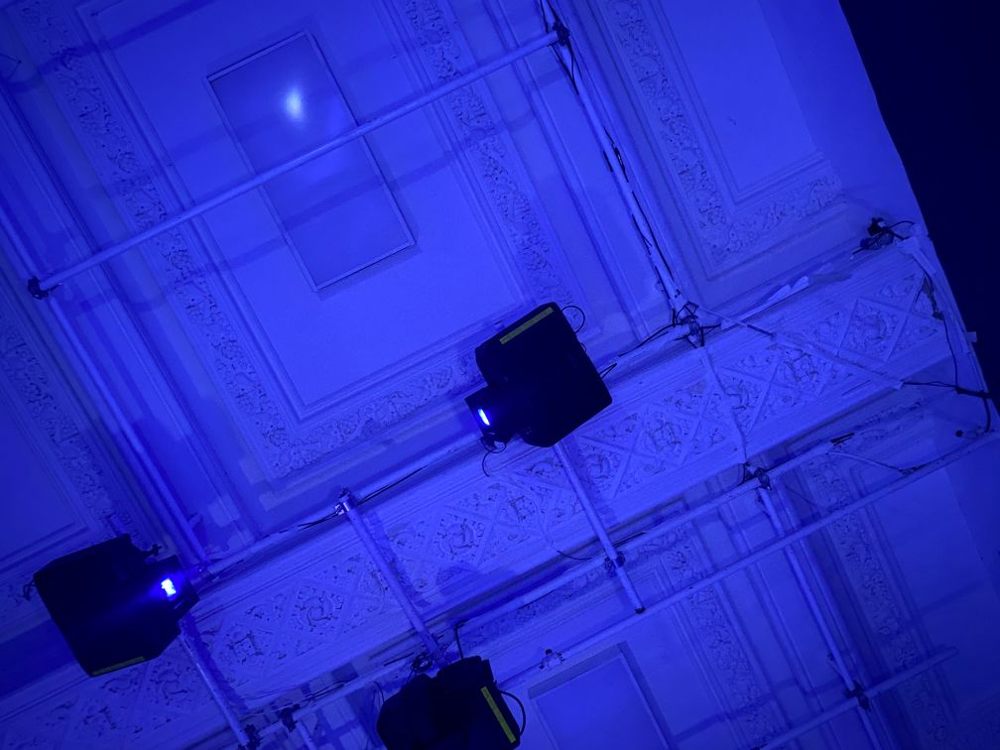
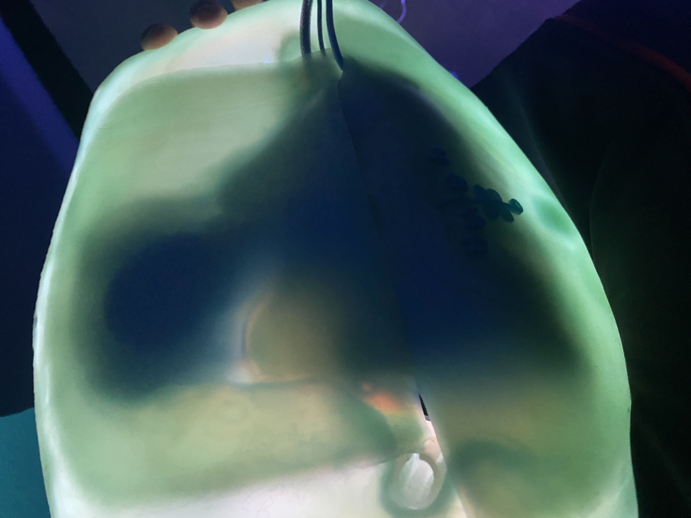

# Keiken: Surconscience sensorielle

### Lieux de mise en exposition
- L'exposition se déroule a la fondatio Phi au 465, rue Saint-Jean pour être plus exacte.

*moi et un inconnu devant l'expositon - photo prise par M-G*

### Type d’exposition
- Temporaire et intérieur. du 23 oct. au 8 mars 2026

### Date de visite
-  Le 20 février 2026

### Titre de l’œuvre  ou du dispositif 
- Spirit Systems of Soft Knowing - 2024

### Nom de l’artiste ou de la firme
- Alexandre Boyes

### Année de la réalisation 
-  2024

### Description de l'œuvre ou du dispositif

*Cartel de l'oeuvre Alexandre Boyes - photo prise par moi même*

### Type d’installation 
-  Immersive et interactive
 
 
 *Vu d'emsemble de l'oeuvre de Alexandre Boyes*
### Mise en espace 
- Un dessin représentant l'oeuvre dans la piece:

*Spirit Systems of Soft Knowing, montrant le plan, les lumières, le projecteur et tout les autres éléments - réaliser par moi même*

### Composante et technique :
- Des projecteurs, les images des projecteurs sont relié au son et au vibration, par exemple, quand un gros son, comme le chant d'une baleine, les vibration vont êtres plus forte.
### Éléments nécessaires à la mise en exposition 
- Murs
- Structure en métal en soutient pour les éclairages et projecteurs
- Un "lit" pour se coucher (fait avec des genre boulles de cotons)
- Des projecteurs
- Un ordinateur
- Des écouteurs
- Un vibrateur resemblant a une carapace de tortu a mettre sur son ventre
  

*La structure de métale et les lumières - photo prise par moi*

*Projecteur, qui projette les images imersif sur les murs - photo prise par moi*

*L'objet en silicone a mettre sur son ventre, qui réagis avec des vibrations en même temps que les son du casque - photo prise par moi*
.jpg)
*PÉcouteurs et socle - photo prise par moi*

### Mon expérience
- J'ai adorer mon expérience, le sujet que traitais l'expo est un sujet que j'aime bien, les jeux vidéos et les expériences immersive, de plus le personnel était très acceuillant.
- Ce qui ma le plus  plu c'est l'exposition que j'ai choisis car c'était la première fois que je fesait une expérience de ce genre, être complêtement ensevli par du son, coucher et une genre de carapace de tortu sur le ventre qui envoie des vibration au rytme des sons, tout ça avec des projections au mur qui rendais tout plus imersif.
- En conclusion j'ai aimé ma sortie et je recommande.

