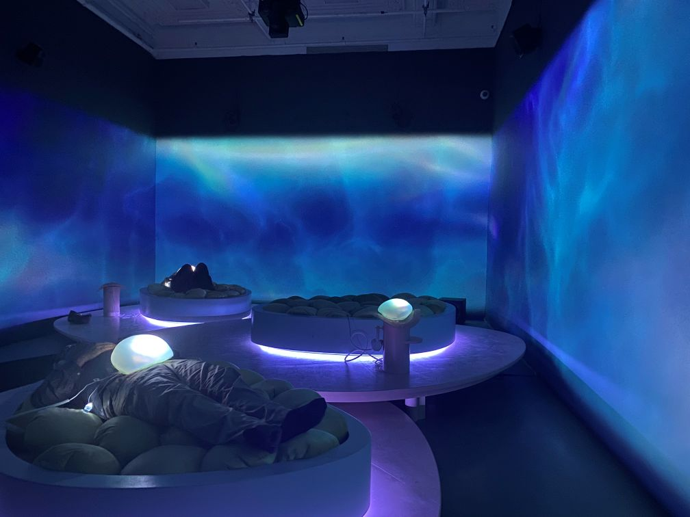
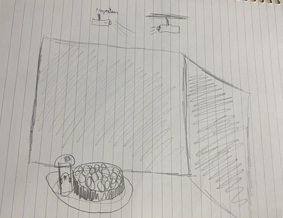
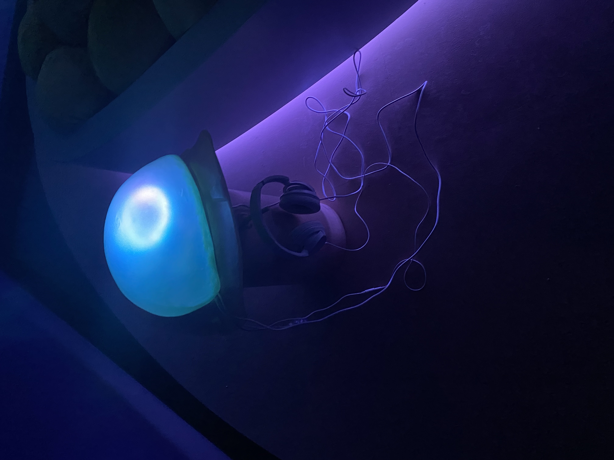

# Keiken: Surconscience sensorielle

### Lieux de mise en exposition
- L'exposition se déroule a la Fondation PHI au 465, rue Saint-Jean pour être plus exacte.

> Un inconnu et moi devant l'expositon - photo prise par M-G

### Type d’exposition
- Temporaire et intérieur. du 23 oct. au 8 mars 2026

### Date de visite
-  Le 20 février 2026

### Titre de l’œuvre  ou du dispositif 
- Spirit Systems of Soft Knowing - 2024

### Nom de l’artiste ou de la firme
- Keiken
- c'est un collectif de 3 artiste 

### Année de la réalisation 
-  2024

### Description de l'œuvre ou du dispositif
- À notre arrivée dans la salle, un membre du personnel nous invite à nous installer sur le lit. On nous met ensuite des écouteurs et l'on place l'utérus haptique en silicone sur notre ventre. Dès cet instant, nous sommes directement immergés dans l'univers de l'œuvre. Les projections de vidéo mapping sur les murs ressemblent à des vagues, et le paysage sonore s'apparente à des chants de baleines. Durant ces deux minutes (ou plus si l'on décide de prolonger l'expérience), les projections sur les murs bleus se déplacent dans otut les sens, lentement. Les vibrations suivent le rythme du paysage sonore pour nous transporter dans un autre monde difficilement descriptible. Je pense qu'il faut véritablement vivre cette expérience pour bien comprendre.

> Cartel de l'oeuvre de Keiken - photo prise par moi même

### Type d’installation 
-  Immersive et interactive

 
 
> Vu d'emsemble de l'oeuvre du collectif d'artiste Keiken
### Mise en espace 
- Un dessin représentant l'oeuvre dans la piece:

> Dessin de l'oeuvre Spirit Systems of Soft Knowing, montrant le plan, les lumières, les 3 projecteurs, le lit, le socle, les écouteurs et l'utérus haptique en silicone - réaliser par moi même

### Composante et technique :
- La vidéo numérique (vidéo mapping)
- Le paysage sonore (la trame sonore)
- L'utérus haptique en silicone
- Le lit fait de tissu, bois et coussins
### Éléments nécessaires à la mise en exposition 
- Les 3 projecteurs
- La plateforme
- Le socle (pour l'utérus haptique en silicone)
- Les écouteurs
- L'ordinateur
- La structure en métal et les murs
  

> La structure de métale et les lumières - photo prise par moi

> Projecteur, qui projette les images imersif sur les murs - photo prise par moi

> Utérus haptique en silicone, a mettre sur son ventre, qui réagis avec des vibrations en même temps que les son du casque - photo prise par moi

> Le socle suportant le casque d'écoute et l'utérus haptique en silicone a mettre sur son ventre - photo prise par moi

### Mon expérience
- J'ai adoré mon expérience. Le sujet que traitait l'exposition rejoint mes intérêts, comme les jeux vidéo et les environnements immersifs. De plus, le personnel était très accueillant.
- Ce qui m'a le plus plu dans l'œuvre que j'ai choisie, c'est que c'était ma première expérience de ce genre : être complètement enveloppé par le son, couché avec l'utérus haptique en silicone sur le ventre qui envoie des vibrations au rythme du paysage sonore. Le tout combiné aux projections sur les murs rendait l'expérience incroyablement immersive.
- En conclusion, j'ai beaucoup aimé ma sortie et je la recommande.

### Référence
- https://phi.ca/fr/evenements/keiken-surconscience-sensorielle/?gbraid=0aaaaadfwfe2np8ygow8mnref-l4ac8sdf
