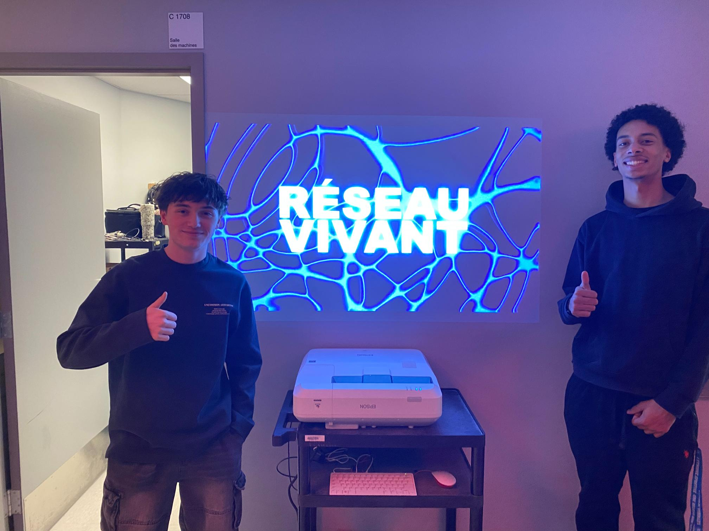
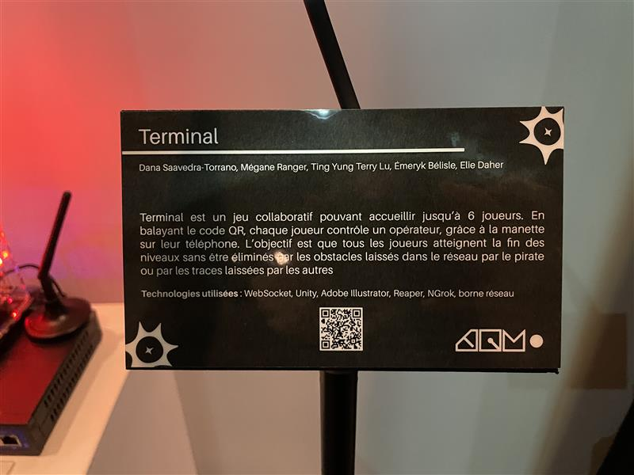
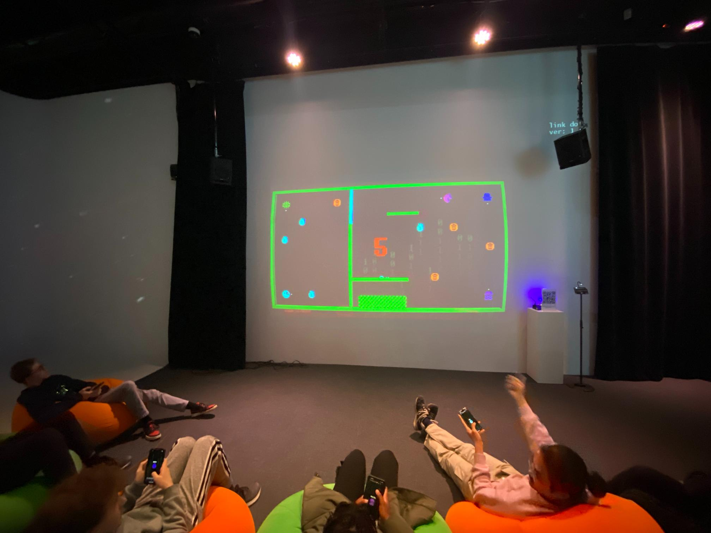

# Terminal
---
## Lieu de mise d'exposition 
- Montmorency -  grand studio

---
 

> Moi devant le grand studio , photo prise par étudiant de TIM
 
---
## Type d'exposition
Temporaire (intérieur)

 
---
## Date de visite
- le 17 mars 2026
 
---
## Titre de L'oeuvre choisi
### Terminal

> Totalité du cartel, photo prise par R-B
 
---
## Noms des créateurs et créatrices
### Meryk Bélisle,Ting Yung Lu Terry, Elie Daher, Mégane Rang et Dana Saavedra-Torrano 
 
---
## Année de réalisation
Du 16 au 20 mars 2026
 
---
## Description de l'oeuvre
TERMINAL est un jeu collaboratif pouvant accueillir jusqu’à 6 joueurs. Chaque joueur contrôle un opérateur, grâce à la manette sur leur téléphone, qui essaie de trouver l'accès au vieux réseau internet afin de restaurer les données qui ont été corrompues par une cyberattaque orchestrée par un fameux pirate informatique. Lorsque les joueurs vont se déplacer, une ligne suit leur trajectoire et devient un obstacle pour les autres opérateurs. L’objectif est que tous les joueurs atteignent la fin des niveaux sans être éliminés par les obstacles laissés dans le réseau par le pirate ou par les traces laissées par les autres. En cas d’élimination, tous les joueurs doivent recommencer le niveau depuis le début. Au fur et à mesure de la progression, les niveaux deviennent de plus en plus complexes, introduisant par exemple des boutons qui ouvrent des passages pour les autres, des obstacles mobiles et bien plus encore.
> source description --> https://pythons-5.github.io/Terminal/#/

 
---
## Type d'installation
### interactive
---
## mise en espace

> image du croquis, créer par moi même
 
---
## Composante et technique 
- Ordinateur principal sur chariot (1): PC de contrôle exécutant Unity, gère le jeu, les connexions et la projection.
- Projecteur (1): Projection murale grand format pour afficher la zone de jeu commune.
- Tablettes / phones (1-6): Contrôleurs utilisés par les joueurs (connexion Wi-Fi).
- Routeur Wi-Fi (1): Permet la connexion des téléphones si le jeu est accessible via navigateur mobile.
- Haut-parleurs amplifiés (2): Diffusion stéréo des sons du jeu pour renforcer l’immersion collective.
- Sender / Receiver (1 chaque): Permet de connecter le cable video de l'ordinateur vers le projecteur.
- Cables Ethernet (3 à 4): Connectez les matériaux à l'internet
- Câbles vidéo (1): HDMI ou DisplayPort reliant le PC au projecteur.
- Câbles audio (2): XLR pour relier la sortie audio aux haut-parleurs.
- Câbles d’alimentation: Selon les haut-parleurs et le projecteur.
- Multiprise / rallonge électrique – Pour alimenter l’ensemble du système. 
- Lumière Baton (2-4): Mettre de la lumière d'ambiance qui change avec une donné en boucle
- Boite de lumière (1): Permet de brancher les lumière en daisy chain et les reliers à l'ordinateur
- Ralonges pour lumières (2-4) Brancher les lumières mêmes si elles sont loins l'une et l'autre
- Power supply pour boite à lumière: Donner le power à la boite à lumières
- Carte graphique extérieur (1): Pour projeter les données vers les couleurs de lumières
 > selon l'équipe de création deriere Terminal 
---

> Le derrière de l'oeuvre "Terminal" d'un point de vue rapproché, photo prise par Christophe Granger

 
---
## Élément nécessaire à la mise d'exposition
- espace intérieur
- Lumière plafond American DJ
- Boules de connections de lumières (2): Faire tenir les lumières droites
- Mur
- Poufs gonflables
- Podium code Qr
---

> L'ensemble de l'oeuvre, photo prise par Christophe Granger
 
---

> L'éclairage au plafonds, photo prise par Christophe Granger
 
 
---
## Ce qui m'a plus
- Ce que j’ai le plus apprécié, c’est à quel point l’expérience était engageante. Ça m’a donné un feeling similaire à quand je joue à des jeux vidéo vraiment bien faits. Le niveau demandait de la réflexion, ce qui rendait le défi plus intéressant. Le fait que ce soit assez strict, où une erreur pouvait affecter tout le monde, ajoutait de la pression, mais aussi un côté satisfaisant quand tout fonctionnait bien.
## Expérience vécu
- Mon expérience était vraiment fun, ça m’a rappelé le feeling que j’ai quand je joue à de bons jeux vidéo. Le niveau était assez complexe, donc c’était intéressant et challengeant. C’était aussi très punitif : si quelqu’un faisait une erreur, tout le monde pouvait en payer le prix, donc ça demandait beaucoup de coordination et d’attention.
 
---
## Ce que je ferais différement
- ce que je ferais de différent à leur place, sa serait surement de faire plus de niveau, aussi j'ajouterais une panoplie d'autre son pour rendre le tout plus imerserif et des objet différents pour pimenter les niveaux telle que des bonus que les joueurs peuvent récuperer ou des malus.
