# Expo Réseau Vivant
## Palmares exposition des étudiants TIM

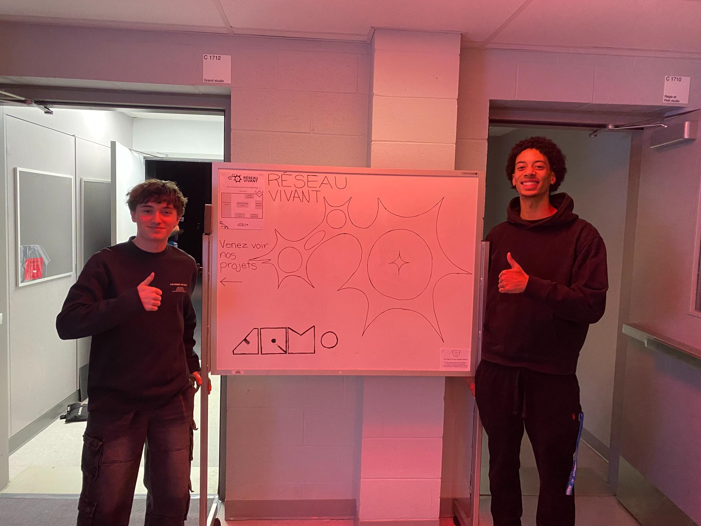
 
## TERMINAL
### noms des créateurs et créatrices:
Émeryk Bélisle,Ting Yung Lu Terry, Elie Daher, Mégane Rang et Dana Saavedra-Torrano 

 
### Installation en cours (ou finale)
photo de l'ensemble de l'installation dans le studio

> photo de l'ensemble de l'oeuvre terminal - photo prise par moi 
### Schéma de l'installation prévue
schéma de mise en espace (plantation ou implantation)
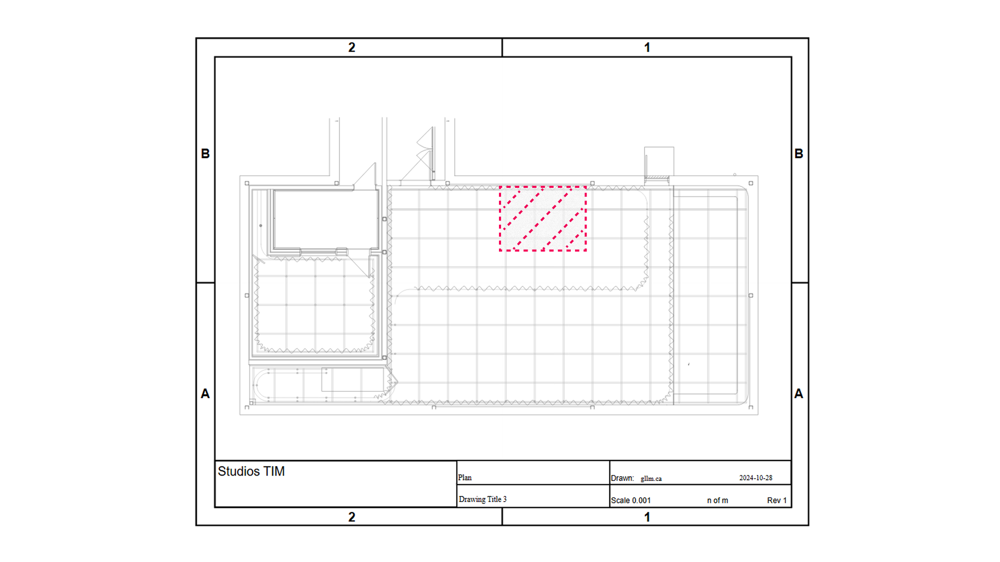

> source des deux images --> *https://pythons-5.github.io/Terminal/#/technique/*
### Ce que vous ressentez en expérimentant chacune des installations, avec justification (avant/après l'expérimentation)
- j'ai vraiment eu du fun à jouer a ce jeu, le fait que ce sois en équipe et que se sois punitif pour tout le monde rajoute du challenge.
---
 
## Mission décollage ( O.I.G.N.I.O.N )
### noms des créateurs et créatrices:
Jad Saloumi, Ahmed Kaissoumi,  Thearylou Lach, Radhouane Kordan et Justin Montpetit

### Installation en cours (ou finale)
photo de l'ensemble de l'installation dans le studio
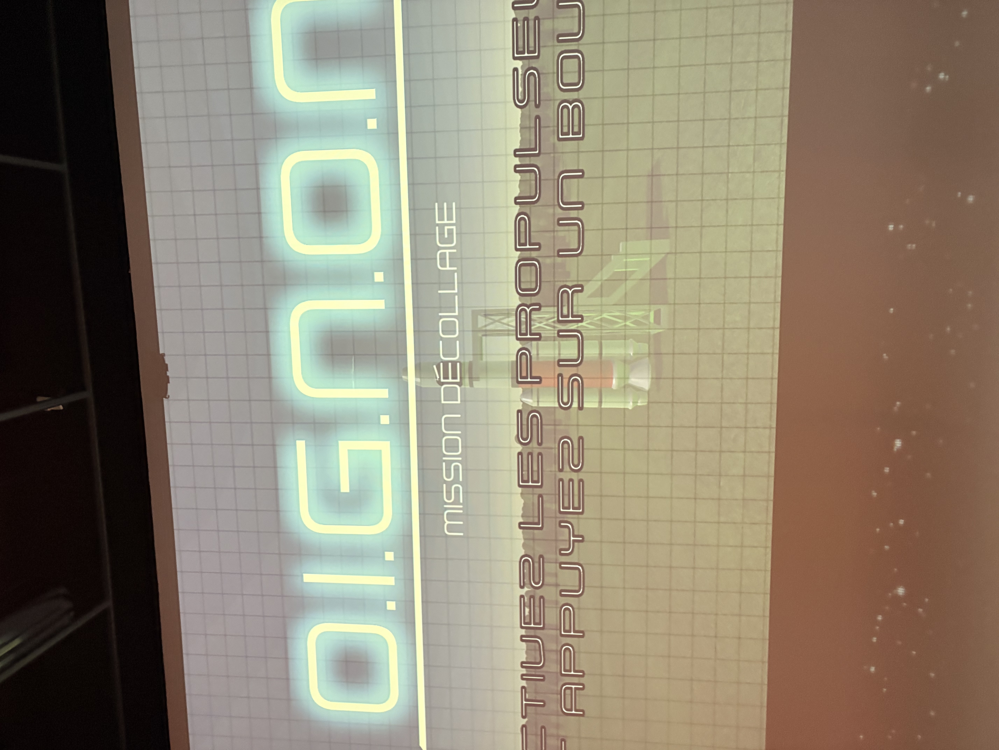
> photo de l'ensemble de l'oeuvre oignon - photo prise par NCY
### Schéma de l'installation prévue
schéma de mise en espace (plantation ou implantation)

> source des deux images --> *https://o-i-g-n-o-n.github.io/Mission-decollage/#/technique/*
### Ce que vous ressentez en expérimentant chacune des installations, avec justification (avant/après l'expérimentation)
-Malgtés le fait que c'était vraiment difficile de finir le jeux et que les contrôlle n'était pas préciser, je me suis quand même amuser a essayer d'esquiver les météorites et a me coordonner avec mes amis!
  
 
---
 

## Symbiose
### noms des créateurs et créatrices:
Yannick Chamberland, Benjamin Ferland et Walid Cheour

### Installation en cours (ou finale)
photo de l'ensemble de l'installation dans le studio
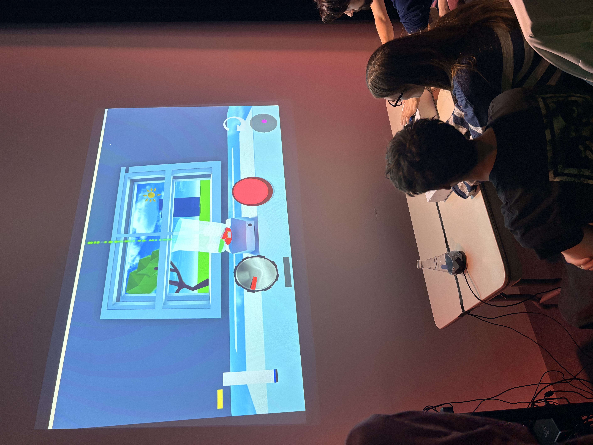
> photo de l'ensemble de l'oeuvre symbiose - photo prise par NCY
### Schéma de l'installation prévue
schéma de mise en espace (plantation ou implantation)

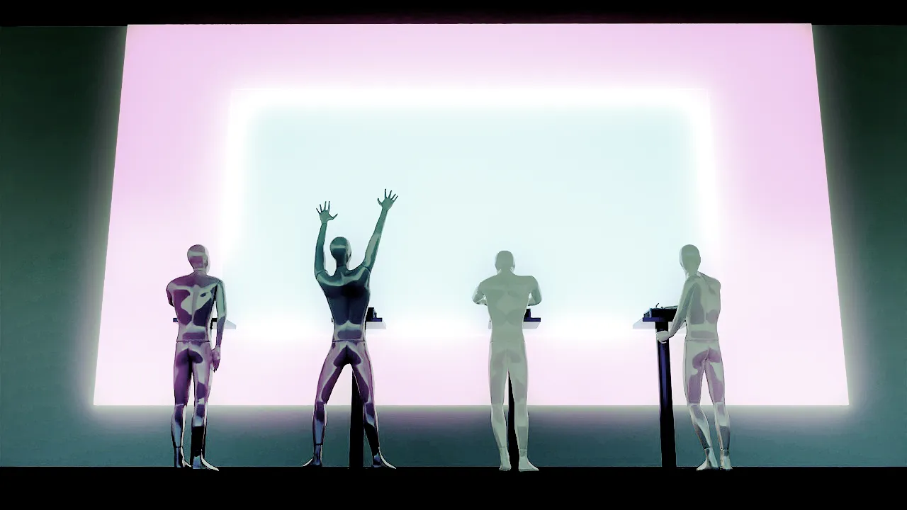
> source des deux images --> *https://les-chimistes.github.io/symbiose/#/technique/*

### Ce que vous ressentez en expérimentant chacune des installations, avec justification (avant/après l'expérimentation)
- Encore une fois, même si il y a certain bug, j'ai bien aimer le fait que que ce sois en équipes et qu'il faut coopérer, le fait qu'il y est un timer ça rajoute de la compétion. J'ai aussi trouver que l'idée ce dermaquais des plusieurs projet que j'ai vu!

---
 
## Arbre-en-face
### noms des créateurs et créatrices:
Alexandre Gendron, Mikael Arseneau, Mattieu Willet, Matis Ghariani et Rafael Angon Dubé
 

### Installation en cours (ou finale)
photo de l'ensemble de l'installation dans le studio
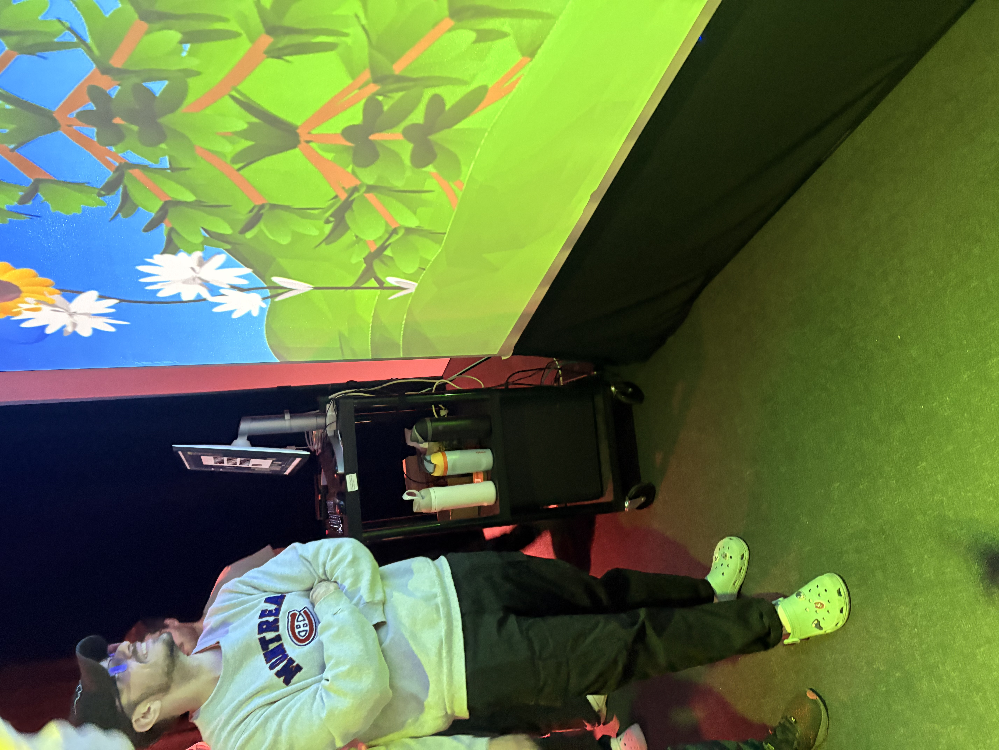
> photo de l'ensemble de l'oeuvre arbre en face - photo prise par NYC
### Schéma de l'installation prévue
schéma de mise en espace (plantation ou implantation)

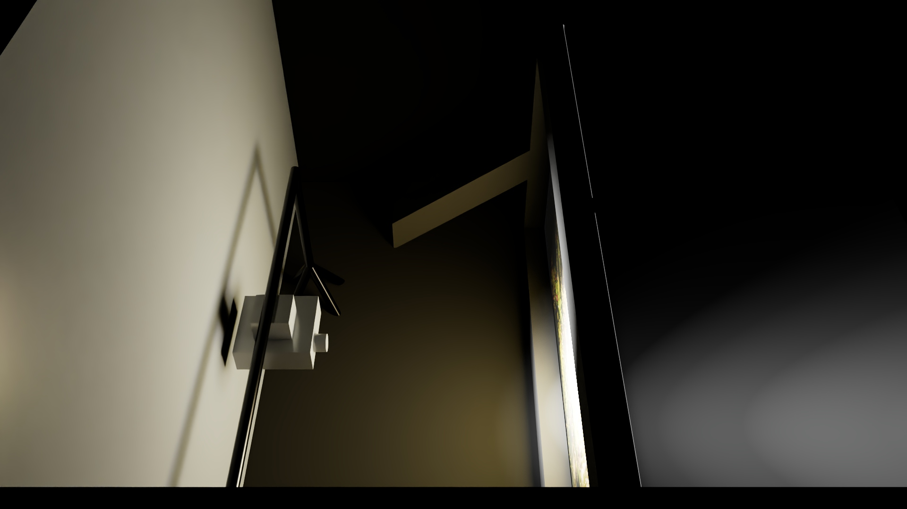
> source des deux images --> *https://mammouths.github.io/projet/#/technique/*
### Ce que vous ressentez en expérimentant chacune des installations, avec justification (avant/après l'expérimentation)
 - au début j'ai eu beaucoup de difficulté a comprendre le mécanismes deriere, avant qu'on me le dise. J'ai trouver que c'était vraiment originale, c'était la premiere fois que je voyais ce genre de technologie, et même ajourdh'ui je trouve que l'aspect technologique qu'il on utiliser est fascinant.
---
 
## Quand les yeux se croisent
### noms des créateurs et créatrices:
Manel Yaya, Edelwyn Ledru, Félix Lavoie, Jade Hébert, et Patricia Nassif

 
---
### Installation en cours (ou finale)
photo de l'ensemble de l'installation dans le studio
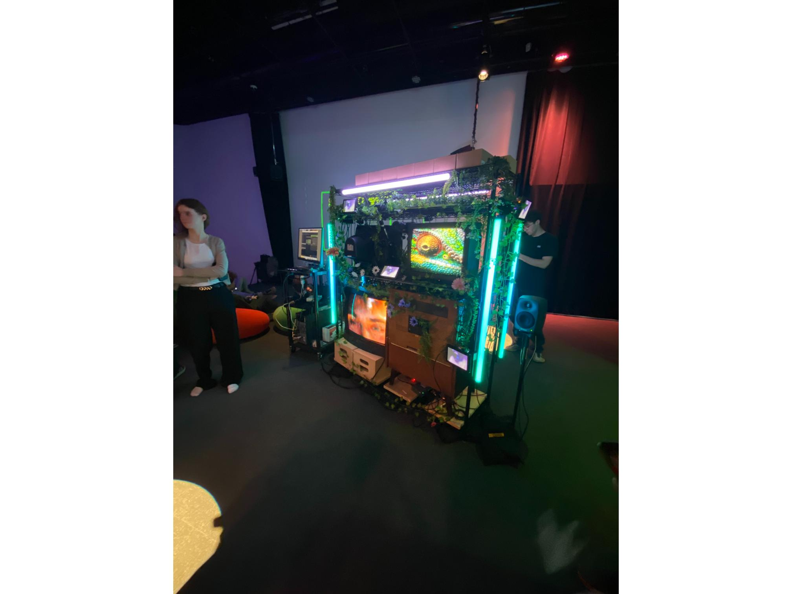

### Schéma de l'installation prévue
schéma de mise en espace (plantation ou implantation)
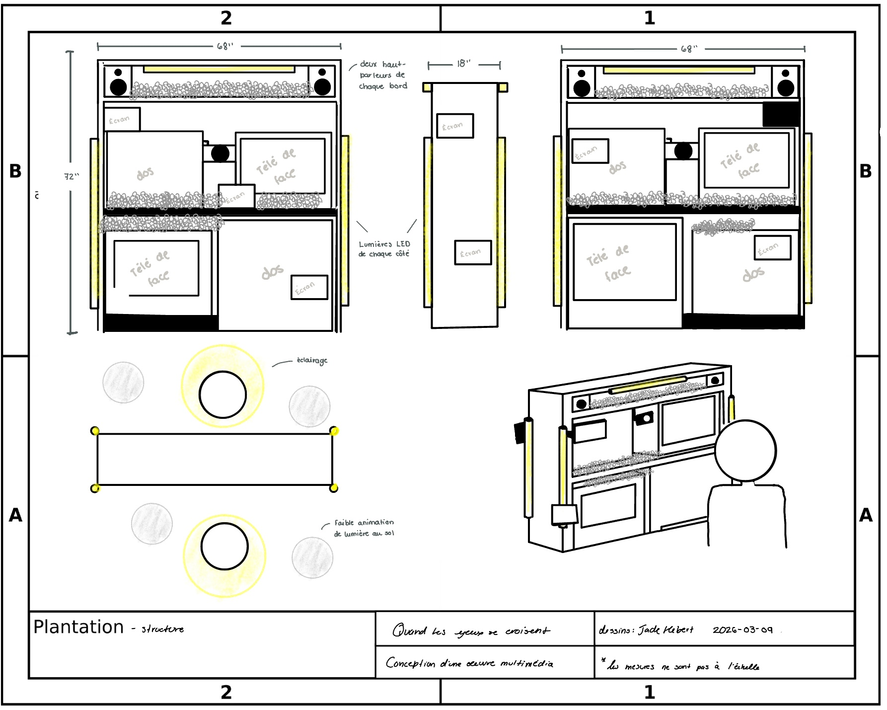
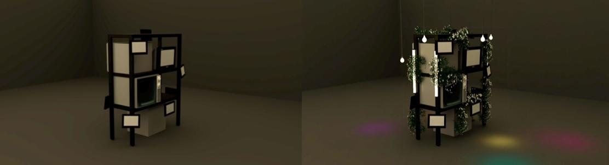
> source des deux images --> *https://emersiaa.github.io/Quand-les-yeux-se-croisent/#/technique/*
### Ce que vous ressentez en expérimentant chacune des installations, avec justification (avant/après l'expérimentation)
- j'ai trouver le sound effect incroyable et je me sentait vraiment imerser dans l'oeuvre, cependant j'ai trouver que le temps qu'on se positionne et le temps que notre oeil apparaisse sur l'écran quand même long et la qualité un peu mauvaise, mais overall c'était une très belle expérience
---
## Océan rouge
### noms des créateurs et créatrices:
Amira Tounekti et Kristy Moussally
 

### Installation en cours (ou finale)
photo de l'ensemble de l'installation dans le studio
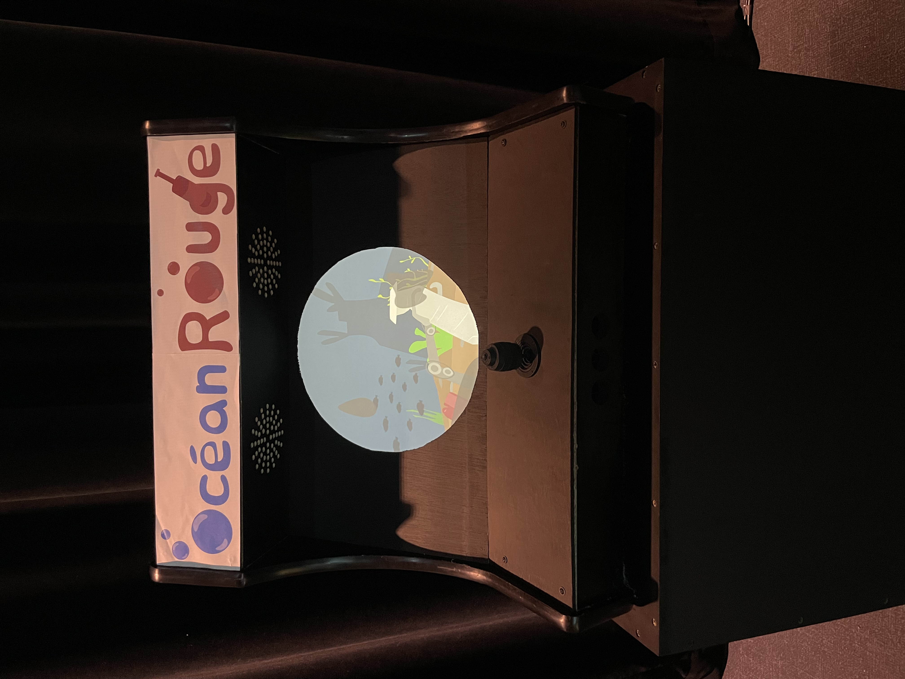

### Schéma de l'installation prévue
schéma de mise en espace (plantation ou implantation)
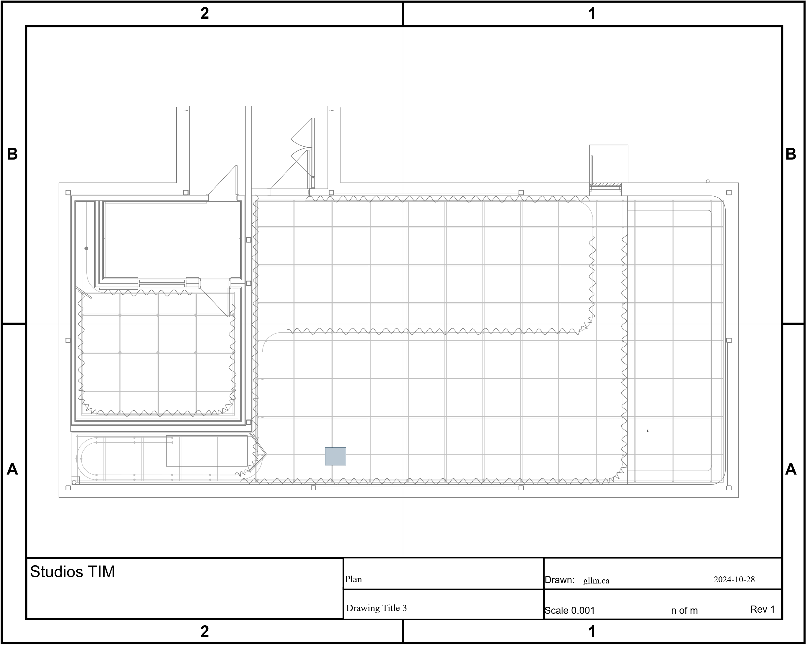
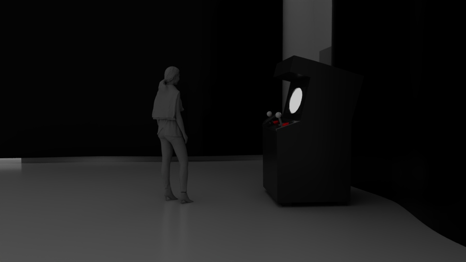
> source des deux images --> *https://deux-intelligence.github.io/deux-neurones/#/technique/*

### Ce que vous ressentez en expérimentant chacune des installations, avec justification (avant/après l'expérimentation)
- J'ai ressentie de l'incompréhension lorsque j'ai tester l'instalations car je ne comprenais pas comment le jeux marchais ce n'était pas clair, je ne savais pas quoi faire et il n'y avait aucun but
- apres avoir la finalisation, j'ai trouver que le jeux était pire parce que la vision était encore plus troubler par la vitre du sous marin et les taches de saleté.
 

---
 
## Trois cours du programme qui vous semblent incontournables pour avoir les compétences pour créer ce genre de projet
### Programmation interactive 
- La programmation est importante dans ce projet parce que ça aide à comprendre comment réfléchir pour créer quelque chose qui marche. On en a besoin pour développer tout le projet, passer des idées au concret et faire fonctionner les différentes parties. Sans programmation, le projet ne pourrait pas vraiment exister.
### Web
- Le web est important dans ce projet parce que le design d’interface permet de rendre le projet clair et agréable à utiliser. Le HTML et le CSS, qui sont la base pour moi, servent à construire et organiser le site. Ça aide aussi à mieux comprendre d’autres langages et programmes par la suite.
### Modelisation 3D
-La 3D est importante dans ce projet parce qu’elle permet de créer des visuels et des environnements en 3D. Ça aide à mieux représenter les lieux et à rendre le projet plus réaliste et immersif.

## Nommer et décrire une technique ou une composante technologique qui est utilisée dans l'un des projets et que vous ne connaissiez pas.
-Les lasers, pour envoyer la coordoner des doigts dans le projet d'arbre en face 
