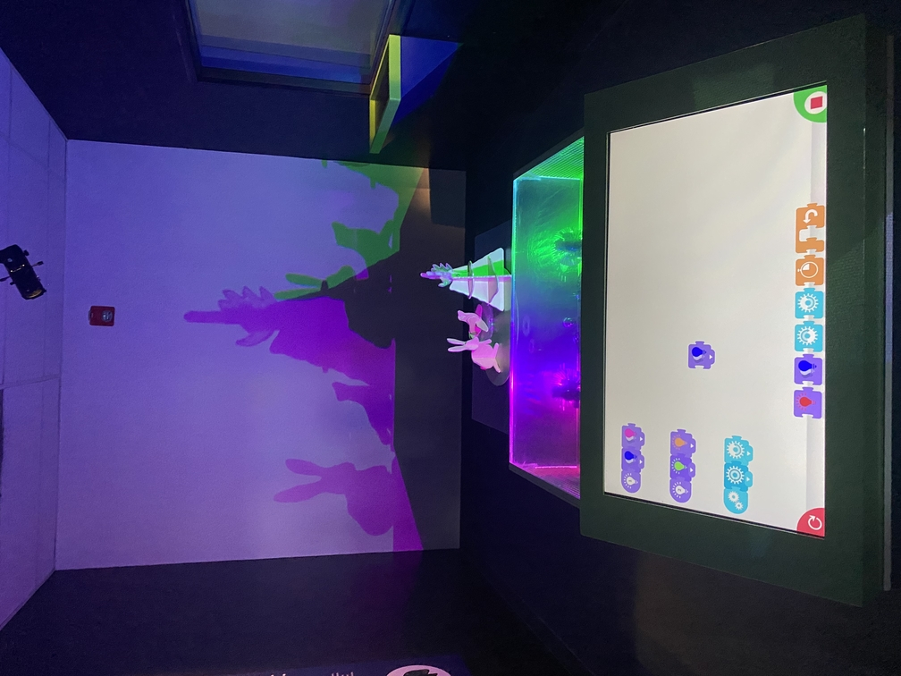

# Titre de l’exposition
- Explore

## Lieu de l’exposition
- Centre des sciences Mtl

> moi devant l'exposition du centre des science - photo prise par R-B

## Type d’exposition
- Intérieure, permanente

## Date de visite
- 1e Avril

## Titre du dispositif
- Codes des ombres ou Language des ordinateurs 

> vu ensmeble du dispositif -- photo prise par Christophe Granger)
## Description du dispositif
- Codes des ombres est un dispositif ou peut importe notre age. nous pouvons coder et transformer du code en lumière. Il y a un écran avec une page blanche ou l'on peu glisser des bout de codes pour changer la rotation des engrenages, le temps et la vittesse,pour envoyer des couleurs sur des figurine en bois sur un plateau pour projeter des ombres de couleurs sur le mur. 

> écran vcg
## Nom de la firme
- Ubisoft 
- Elisabeth Doyon - programmeuse généraliste - chercheuse en informatique cognitive - Generalist Programmer - Cognitive Computing Researcher

- Adrien Logut - programmeur Gameplay- Gameplay Programmer - Andrea Feder - directrice de production - Production Manager

> photo des crédit de l'oeuvre - centre des sciences zone interactive - photo prise par Christophe Granger

## Année de réalisation
- 

## Type d’installation
- Interactive

## Mise en espace

## Composantes et techniques
- un ordinateur
- écran tactile
- composantes électrique
- des lumieres
- fils électrique
- ventilation
- moteur 
- projecteur 

## Éléments nécessaires à la mise en exposition
- boitier pour la 
- boitier pour l'écran
- figurine de bois pour les ombre 
- mur

## Mon expériences
- Franchement, j’ai vraiment aimé l’expérience. C’était interactif et ça change des expos normales où tu fais juste regarder. Le mélange entre l’art et la techno est super bien fait, c’est pas quelque chose qu’on voit souvent. En plus, c’est facile à comprendre pour tout le monde, peu importe l’âge. C’est simple, original et vraiment réussi.je trouve que c'est un bon moyen d'apprendre la programmation au plus jeune sans se casser la tête, de plus le dispositif est vraiment très accessible pour tout les age et tout les condition physique, il y a un espace vide en bas de l'écran pour les perosnne en fauteuille roulant et l'écran se trouve a un bas niveau pour les plus petit.

